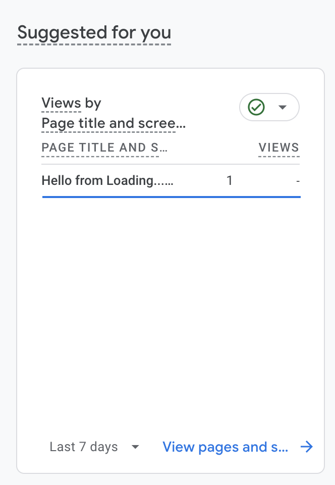

## Yay my second post is here

I published my first blog post last weekend and here is my second blog post. I'm hoping to post weekly. What did I do last week? As you can see on the main page, I made some small changes. I changed the title and tagline thanks to Google Gemini's suggestion.

I also added Google Analytics (GA) to my page to view the number of visitors. It's a success! I can see the number in Google Analytics now. And, for now, I'm the only viewer of my blog. It's not a problem though, since my goal isn't becoming a KOL of Code 😶‍🌫️

Below is the screenshot of the GA dashboard. And only one reader (me 🤣) at the moment 🤓

